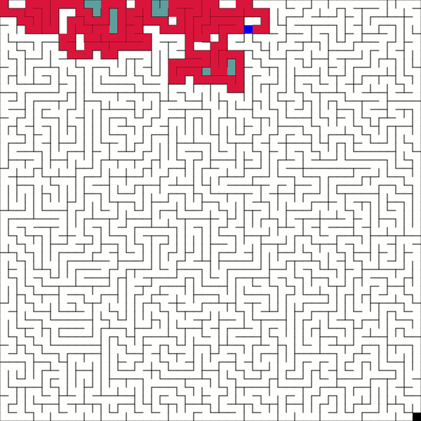

# Maze
A project inspired by maze screensaver contained in the XScreenSaver collection.

  

### Maze Generation
Random mazes where every path can be visited are generated and can be saved as text or image file.

### Maze Solver
A path through a given maze can be found using a naive search algorithm as the exit is unknown and must be discovered.

### Maze Visualization
Both the generation of a  maze and the algorithm finding a path through the maze can be visualized.
